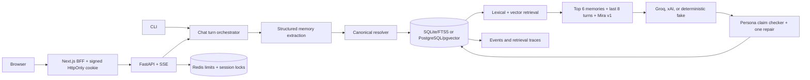

# Companion AI Core Loop

Companion AI Core Loop is a persistence-first companion product built around a fixed persona,
auditable long-term memory, contradiction resolution, hybrid retrieval, and measurable persona
consistency. Its assessment core runs locally without paid credentials; its production path adds a
protected Next.js experience, FastAPI/SSE, PostgreSQL/pgvector, Redis, and replaceable Groq/xAI
providers through OpenAI-compatible Responses APIs.

The companion is **Mira**: warm, grounded, lightly playful, non-romantic, and able to mirror
English or natural Hinglish. Her identity is a versioned artifact rather than an improvised system
prompt.

## Assessment status

The credential-free deterministic suite currently reports:

| Metric | Result |
| --- | ---: |
| Persistence accuracy | 100% |
| Recall@5 | 100% |
| Precision@5 | 20% (one relevant item in five slots) |
| Factual recall accuracy | 100% |
| Contradiction resolution accuracy | 100% |
| Superseded-memory leakage | 0% |
| Persona contradiction rate over 52 pressure turns | 0% |
| Subjective tone adherence | Not run—requires a separate live judge run |

These values come from [the committed report](evals/results/deterministic-v1.json). The suite never
substitutes a heuristic score for the unavailable subjective judge.

## Architecture



Every user turn follows a fixed order:

1. Persist the user message.
2. Extract typed memory candidates.
3. Resolve add, update, supersede, or ignore decisions.
4. Retrieve active memories through FTS5 and 384-dimensional embeddings.
5. Generate with Mira's versioned persona, at most six memories, and the last eight messages.
6. Extract assistant self-claims, repair a persona conflict once, and use a safe fallback if needed.
7. Persist the assistant response, companion claims, audit events, and retrieval trace.

No endpoint or CLI command exposes hidden chain-of-thought. `explain-last-turn` contains only
observable candidates, decisions, selected memories, and numeric score factors.

## Repository layout

```text
apps/api/                     FastAPI, domain, storage, AI providers, CLI, and tests
apps/web/                     Protected Next.js BFF and responsive chat application
.railway/                     Railway project-level infrastructure as code
evals/scenarios/              Versioned deterministic scenarios
evals/results/                Real committed evaluation output
docs/                         Architecture and walkthrough notes
```

The private planning artifacts `problemstatement.md` and `implementationplan.md` are intentionally
local-only. `.git/info/exclude` hides them and a local pre-commit hook rejects accidental staging.

## Setup

Prerequisites are Node.js 24 LTS, pnpm, Python 3.12, and
[uv](https://docs.astral.sh/uv/). The repository's `.nvmrc` and `.python-version` pin the runtimes.

```bash
nvm use
make setup
make lint
make test
make test-e2e
make demo
make eval
```

`make demo` uses the deterministic provider and an isolated local SQLite database. It demonstrates
Pune → Bengaluru supersession, recall, and an explainable retrieval trace.

To use GroqCloud, copy `.env.example` to `.env`, keep it untracked, and configure:

```dotenv
LLM_PROVIDER=groq
GROQ_API_KEY=your_key_here
GROQ_CHAT_MODEL=openai/gpt-oss-120b
GROQ_EXTRACTION_MODEL=openai/gpt-oss-20b
EMBEDDING_PROVIDER=multilingual-e5
```

The Groq provider uses its OpenAI-compatible Responses API. The 120B production model handles
conversation, while the faster 20B production model handles Pydantic structured extraction. Both
support strict JSON-schema outputs. See the
[Groq Responses API](https://console.groq.com/docs/responses-api) and
[structured-output documentation](https://console.groq.com/docs/structured-outputs).

The existing `LLM_PROVIDER=xai` adapter remains available when an xAI/Grok deployment is preferred.

## CLI

```bash
uv run --package companion-ai-api companion chat
uv run --package companion-ai-api companion chat -m "My name is Praveen"
uv run --package companion-ai-api companion memory list
uv run --package companion-ai-api companion memory history
uv run --package companion-ai-api companion explain-last-turn
uv run --package companion-ai-api companion reset
```

The database survives process restarts. Reset permanently deletes the session, its messages,
memories, events, and traces through foreign-key cascades.

## Web and API

Run the two development processes in separate terminals after `make setup`:

```bash
make api
make web
```

Open `http://localhost:3000` and use the development passcode from `.env` (the example is
`companion-demo`). The browser talks only to same-origin Next.js route handlers. The BFF signs the
anonymous session into an HttpOnly cookie and calls FastAPI with `INTERNAL_API_KEY`; backend
credentials are never placed in the client bundle.

The API surface is session-scoped:

- `POST /v1/sessions`
- `POST /v1/chat` with SSE events and a client-generated `request_id`
- `GET /v1/sessions/{id}/messages`
- `GET /v1/sessions/{id}/memories`
- `DELETE /v1/sessions/{id}`
- `GET /health/live` and `GET /health/ready`

The inspector exposes active/superseded memories, resolver events, retrieval scores, and degraded
mode—not prompts or chain-of-thought.

## Memory behavior

- Stable profile facts, preferences, states, plans, and meaningful events are eligible.
- Greetings, filler, credentials, model guesses, and disposable small talk are rejected.
- Repeated values refresh confidence and metadata.
- Preference/profile corrections update in place and retain the previous snapshot in the event log.
- Current location, relationship, health, work, and plan changes create a new active record and
  supersede the old record.
- Historical events have value-and-time-based identities so they can coexist.
- Superseded records remain auditable but are excluded from lexical and vector retrieval.
- Decay changes ranking only; it never deletes audit history.

## Why a custom memory engine

The assessment is specifically about understanding and proving the core loop. A custom resolver
makes canonical keys, transactions, active-record uniqueness, decay, ranking, and failure behavior
visible in code and tests. Mem0 is a sensible later benchmark or adapter, but using it as the primary
implementation would hide the exact behavior being evaluated. It is intentionally deferred until
after the `assessment-v1.0.0` tag.

## Approaches considered and not selected

- **Dumping the full memory store into every prompt:** rejected for privacy, cost, context pollution,
  and increased prompt-injection surface.
- **Vector-only retrieval:** rejected because exact names and corrections benefit strongly from
  lexical matching; RRF combines both signals without score calibration.
- **Deleting corrected facts:** rejected because it destroys provenance and makes regressions hard
  to diagnose.
- **Using an LLM for every conflict:** rejected for deterministic state/location rules. The active
  provider is reserved for genuinely ambiguous contradiction decisions.
- **Cloud embeddings for the assessment:** rejected to keep local development credential-free and
  to support English/Hinglish without a second paid provider.

## Known limitations

- The deterministic extractor is deliberately narrow and exists only for credential-free demos.
  Production extraction uses strict structured outputs from the configured provider.
- `intfloat/multilingual-e5-small` is optional and downloaded separately; tests use a deterministic
  hash embedding with the same 384 dimensions.
- SQLite vector search is an exact in-process scan suitable for the assessment, not high scale.
- Subjective tone scoring is pending a separate live judge run and must not be inferred from
  deterministic assertions.
- Account authentication, cross-device identity, mobile clients, custom domains, and billion-user
  scaling are outside this delivery's definition of production readiness.

Production API, PostgreSQL/pgvector, Redis controls, the protected frontend, CI hardening, and
Vercel/Railway deployment artifacts are implemented after the assessment tag. See the operations
runbook for the staging-first release and the two external prerequisites: a provider key and the
one-time pgvector extension command.

## Further reading

- [Detailed architecture](docs/architecture.md)
- [15–20 minute assessment walkthrough](docs/walkthrough.md)
- [Production operations and recovery runbook](docs/operations.md)
