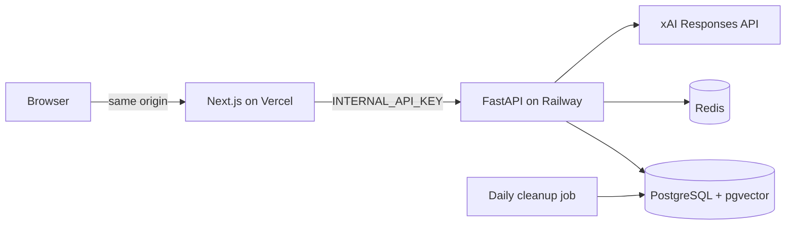

# Architecture notes

## Invariants

The memory store enforces one active row per `(session_id, canonical_key)` with a partial unique
index. A correction never overwrites history silently: each add, update, supersede, ignore, or
extraction failure writes an immutable event. A superseding transaction marks the old row first,
creates the replacement, links both rows, and commits them together.

SQLite is the assessment adapter. PostgreSQL uses the same SQLAlchemy repository contract with
PostgreSQL full-text search and a `vector(384)` column. The ranking formula and active-memory
invariants remain identical across adapters. Alembic owns schema evolution in both environments.

## Memory lifecycle

| Candidate | Decision | Stored result |
| --- | --- | --- |
| Not memory-worthy | Ignore | Event only |
| New canonical key | Add | One active row + event |
| Same normalized value | Update | Same row + previous snapshot event |
| Corrected preference/profile | Update | Same row + previous snapshot event |
| Changed current truth or plan | Supersede | Old audit row + linked active replacement |
| Meaningful historical event | Add | Independent event key based on date and value |

Rules handle deterministic cases. A typed Grok contradiction decision is available for ambiguous
stable-fact corrections, but its allowed actions are constrained to update, supersede, or ignore.

## Retrieval

The retriever requests the top 20 lexical candidates and top 20 vector candidates. SQLite lexical
search uses FTS5; the assessment vector adapter computes exact cosine similarity over stored
384-dimensional vectors. Each list is fused with Reciprocal Rank Fusion (`k=60`). The normalized RRF
score is combined with importance, type-aware freshness, and token/entity overlap:

```text
final = 0.65 * rrf + 0.15 * importance + 0.12 * freshness + 0.08 * entity_overlap
```

Profile facts use a 3,650-day half-life, preferences 180 days, current states 30 days, events 365
days, and plans 60 days. An overdue plan switches to a seven-day half-life. Only the top six active
memories enter the generation context.

## Failure boundaries

| Failure | Behavior |
| --- | --- |
| Structured extraction fails | Continue response; record `extraction_failed` event |
| Resolver or memory transaction fails | Abort before generation |
| Embedding generation fails | Store fact without a vector; retrieval records lexical-only mode |
| Generation fails | Keep user message; never persist a partial assistant message |
| Persona extraction/repair fails | Persist and return a fixed persona-aligned fallback |

The API adds one-active-request-per-session Redis locking and client-generated request idempotency.
A repeated completed request returns the stored assistant result; a concurrent request for the same
session receives a retryable conflict instead of racing the memory transaction.

## Production boundaries



The browser receives only a signed, Secure, HttpOnly, SameSite=Lax session cookie. Next.js is the
backend-for-frontend and holds both the Railway URL and internal API key server-side. FastAPI limits
messages to 4,000 characters, applies per-IP and per-session limits, serializes turns per session,
and redacts conversation content from structured logs.

Railway runs the API and cleanup job in Singapore. A pre-deploy Alembic command must succeed before
a new API deployment is promoted. Readiness checks configuration, PostgreSQL, Redis, and the vector
extension without spending an xAI request. The daily cleanup command deletes expired session graphs
through database cascades.

## Security and privacy posture

Memory text is treated as untrusted data and delimited separately from system instructions. Normal
logs include request ID, a hashed session ID, latency, model/token metadata, retrieval count, and
resolver actions, but no raw conversation content. The inspector exposes memory provenance and
scoring, not prompts or hidden reasoning. Secrets belong in runtime environment variables; `.env`,
databases, model caches, and build output are ignored.
